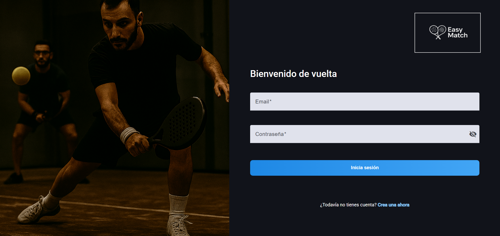
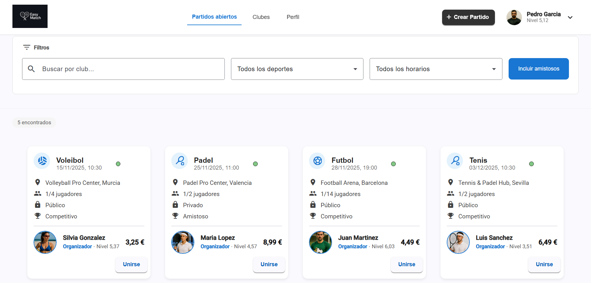
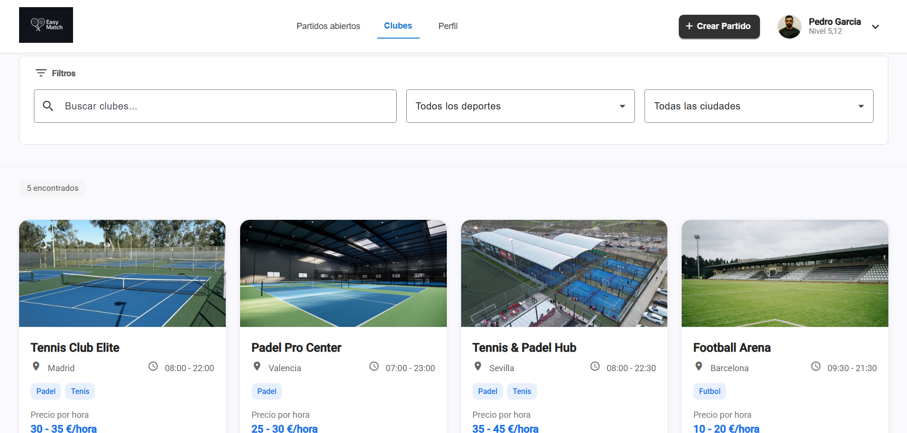
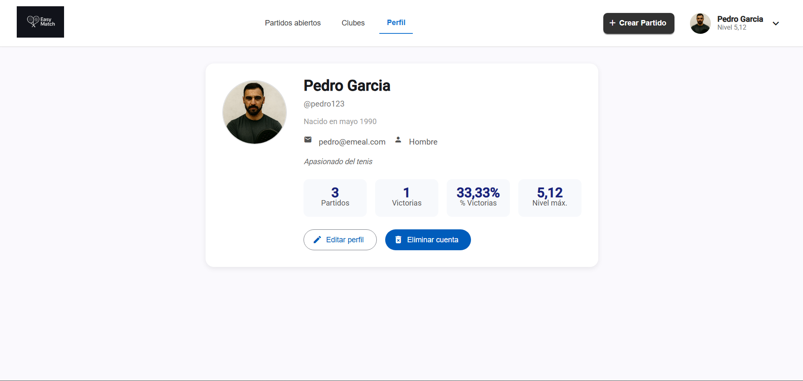

# 2025-EasyMatch
### 📖 Introduction
EasyMatch is a website that helps you **organize** padel, tennis, beach volleyball, or football **matches** — either with friends (**private**) or with strangers (**public**) at a similar skill level. It also includes a live chat feature to communicate with other players or to get help from clubs or the site’s administrators.   

In this document, the functional and technical objectives of the EasyMatch application have been defined. While the current implementation is **functional** and includes the **essential features**, the website is still under active development in order to extend and improve its overall functionality.

#### Summary of version 0.1 functionality
Version 0.1 of this application provides the **core functionality** required to **organize** and manage **sports matches** in a simple and effective way. At this stage, **anonymous users** can browse registered clubs and search for available matches without authentication, while **registered users** are able to create public or private matches, join existing ones, and view basic profile information and match history. As well as deleting their own account. **Administrators** have full permissions to view, create, edit, and delete any entity on the platform in order to ensure proper usage and system integrity.

##### Open matches page 

##### Clubs page 

##### Profile page

##### Admin page

### Future development and planned functionalities

In upcoming versions, the EasyMatch application is expected to incorporate **intermediate and advanced functionalities**. These include the ability for users to **add, edit, and validate match results**, visualize skill-level progression through analytics and charts, and communicate in real time via an **integrated chat system**. Additionally, **more sophisticated rating algorithms** will be introduced to dynamically adjust player levels based on match outcomes and opponent strength. From an administrative perspective, future releases will also provide advanced moderation tools, incident management, and deeper access to platform activity data.

To see the **main functionalities** of this version of the website, watch the following videos attached below:

##### Registered users

https://github.com/user-attachments/assets/d3e034ac-da1c-4f17-a090-8ceda25d31c8

##### Administrators

https://github.com/user-attachments/assets/0095e56f-bfc6-4e7b-bafd-28fb4b955b34

## Table of contents

- [Objectives](#objectives)
- [Methodology](#methodology)
- [Detailed functionalities](#detailed-functionalities)
- [Analysis](#analysis)
- [Monitoring](#monitoring)
- [Authors](#authors)
- [Development Guide](/docs/DevelopmentGuide.md)
- [Execution](/docs/Execution.md)

## Objectives

### ⚙️ Functional Objectives
The web page aims to **make organizing sports matches easier** by providing a centralized platform where players can search for, create, and join games at partnered clubs. It also seeks to improve communication between players and clubs through an integrated chat system.

1. The system should allow users to **create public matches** (open to anyone) or **private** matches (for friends only), specifying the sport, date, and time.  
2. The system should allow users to **search for and join public matches** at partnered clubs filtering by sport, skill level, date, city...  
3. The system should allow users to **leave those matches** before they are closed, meaning before all spots have been filled.  
4. The system should allow users to **view and edit their basic information** (profile picture, username, match history, skill-level graph, etc.). Likewise, the system should allow them to delete their account.  
5. The system should allow users to **add the result of a completed match**, which must then be validated by both pairs of players.  
6. The system should include a **real-time communication channel** that allows players to chat with each other, as well as with club staff and site administrators, to resolve questions or issues.  

---

### 💻 Technical Objectives
The website will be implemented using technologies that are well-established both academically and professionally, like **Spring Boot** for the backend, **Angular** for the frontend, and **MySQL** as the database management system. Additionally, software quality will be ensured through continuous integration and deployment using **GitHub Actions**, along with a set of automated tests that guarantee the reliability of the core functionalities.

1. The system should follow a **SPA (Single Page Application)** architecture, using the **Angular** framework for frontend development.  
2. The system should provide a backend based on **Java** with **Spring Boot**, implementing a **REST API** to handle business logic.  
3. The system should have a **continuous integration and deployment (CI/CD)** pipeline, set up with **GitHub Actions** to automate the build, testing, and deployment processes.  
4. The system should use a **MySQL relational database** to store structured information (entities).  
5. The system should have a **GitHub repository** for version control and software lifecycle management.  
6. The system should include **unitary tests** developed with **JUnit and Mockito** to ensure the correctness of the backend logic.  
7. The system should implement **integration tests** using **Rest Assured** to validate communication with the REST API.  
8. The system should carry out **end-to-end tests** with **Selenium** to verify the proper functioning of the frontend from the user's perspective.  
9. The system must be packaged in **Docker** containers to ensure portability, facilitate deployment, and guarantee consistency across development, testing, and production environments.  
10. The system should implement **real-time communication via WebSockets** to enable the chat feature.

## Methodology
The development of the website will be carried out following an **incremental** and **iterative** approach, which allows the system to be built in **successive phases**, delivering functional versions at the end of each one. 

### 🗂 Phases:

- <ins>**Phase 1 (1st to September 15th)**</ins> : **Definition of functionalities** 
  In this phase, the functional and technical objectives of the website have been gathered and documented. The general functionality description is located in the _**Objectives**_ section specifically in the _**Functional objectives**_ subsection. In contrast, the detailed description of each functionality and its intended audience can be found in the _**Detailed functionalities**_ section.

- <ins>**Phase 2 (September 15th to October 15th)**</ins> : **Configuration of technologies and development tools with quality controls that are carried out periodically** 

- <ins>**Phases 3, 4 & 5 (October 15th to April 15th)**</ins>: **Iterative and incremental development of the application. At the end of each phase, a new release will be published** 

- <ins>**Phase 6 (April 15th to May 15th)**</ins>: **Writing the final report** 

- <ins>**Phase 7 (May 15th to June 15th)**</ins>: **Preparation of the presentation** 

---

## Detailed Functionalities

### 🟢**Basic Functionalities**
All basic functionalities described below **are already implemented**. These allow the website to fulfill its minimum purpose — organizing matches.

#### 🧑‍🤝‍🧑**Registered User**
- **Create public and private matches**, specifying club(location), sport, mode, time, and price. 
- **Search and join open matches**, filtering by club, sport and/or schedule (morning, evening or night).
- **Leave a match before the number of spots is filled**.
- **View basic profile information**, including username, real name, email, birth date, basic statistics like win rate, profile photo, current skill level and match history.

#### 🛠️**Administrator**
- **View, create, edit, and delete any entity** including users, matches, sports, and clubs.
- **Moderate and manage all matches** (user or admin-created) to ensure proper use of the platform.
- **Validate, update, or remove club information** to ensure accuracy and consistency.
---

### 🟡**Intermediate Functionalities**
All intermediate functionalities defined below are **not yet implemented**. These enhance the user experience but are not essential for the system to function. 

#### 👤**Anonymous User**
- View **basic information of the clubs** associated with the platform (name, address, available facilities, contact information, etc.).
- **Search for open matches** but not join them.

#### 🧑‍🤝‍🧑**Registered User**
- **Add and edit match results**.
- **See player level progression** through charts.
- **Edit personal information**, such as profile photo, username, phone number, or email address.

#### 🛠️**Administrator**
- **Access and review the global activity history**, including matches, users, and messages.

---

### 🔴**Advanced Functionalities**
All advanced functionalities defined below are **not yet implemented**. These represent the most complex and interactive features, providing full platform functionality.

#### 🧑‍🤝‍🧑**Registered User**
- **Validate match results**, which must be confirmed by both player pairs.

- **Chat in real time** with other players, club staff, or administrators.
- **Advanced skill-level algorithm** that adjusts player ratings based on results and opponents’ levels.

#### 🛠️**Administrator**
- **Participate in chat** as moderator or support.
- **Manage user-reported incidents**, such as unsportsmanlike behavior or result manipulation.

## Analysis
### 🖥️**Screens and navigation**
This section shows a preliminary design of each screen, with a brief description of each and the pages that can be accessed from them.

#### Screen 1: Open matches screen
  
  - **Description:** shows the available matches along with their information such as price, sport,... with filters to select your preferences. Includes a header that contains the shortcuts: **Open Matches**, **Clubs** and **Profile**.
  - **Navigation:**  from this screen you can access Screen 2 and 3 clicking on the shortcuts of the header.

#### Screen 2: Partnered clubs screen 
  
  - **Description:** displays the clubs associated with the website, alongside with their basic information (location, telephone...). Includes the header and filters to select preferences for where to play. 
  - **Navigation:** from this screen you can access Screen 1 and 3 clicking on the shortcuts of the header.

#### Screen 3: My profile screen
  
  - **Description:** Brief explanation of the screen, its purpose, and main functions.  
  - **Navigation:** from this screen you can access Screen 1 and 2 clicking on the shortcuts of the header.

### 🗃️**Entities**
The website’s data model is composed of the  <ins>**entities**</ins> User, Match, Club y Message. Below, their attributes and relationships are shown in the following diagram:    
   

### 🔑**User permissions** 
The table below details the permissions by user type (anonymous, registered and admin):

| **Entity**        | **Operation** | **Anonymous user** | **Registered User** | **Administrator** |
|-------------------|---------------|----------------------|-------------------------|-------------------|
| **Club**          | View     |                    |                       |                 |
|                   | Create         |                    |                       |                 |
|                   | Edit     |                    |                       |                 |
|                   | Delete      |                    |                       |                |
| **Match**       | View     |  *(only open)* |                       |                 |
|                   | Create         |                    |                       |                 |
|                   | Edit     |                    |                       |                 |
|                   | Delete      |                    |  *(if they leave and were alone)* |        |
| **User**       | View     |                    |  *(own profile)*    |                 |
|                   | Create         |                    |  *(registration)*         |                 |
|                   | Edit     |                    |  *(own profileo)*    |                 |
|                   | Delete      |                   |  *(own account)*    |                 |
| **Message (chat)**| View     |                    |                       |                 |
|                   | Create         |                    |                       |  *(moderation)* |
|                   | Edit     |                    |                       |                 |
|                   | Delete      |                    |                       |  *(moderation)* |

### 🖼️ **Images**
The entities that can have one or more <ins>**images**</ins> associated are Club and User. Each user can upload a profile picture, and clubs can upload images of their facilities.

### 📈 **Charts**
Player skill progression across different sports will be displayed using <ins>**line charts**</ins>.

### ⚡**Complementary technologies**
WebSockets will be used as a <ins>**complementary technology**</ins> to implement real-time chat between players, clubs, and administrators.

### 🧠**Advanced algorithms**
An <ins>**advanced algorithm**</ins> will be implemented to dynamically calculate player skill levels, adjusting the score based on the level difference with opponents.

## Monitoring

## Authors
This web development is carried out in the context of the **Degree’s Final Project** for the Computer Engineering degree, taught at the Escuela Técnica Superior de Ingeniería Informática (ETSII) of the Universidad Rey Juan Carlos,  at its Móstoles campus. The project is being developed by the student _**Daniel Muñoz Martínez**_, under the supervision of professor _**Michel Maes Bermejo**_.

