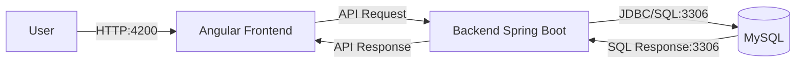

# Development Guide

## 📋 Table of contents

- [Introduction](#introduction)
- [Technologies](#technologies)
- [Tools](#tools)
- [Architecture](#architecture)
- [Quality Control](#quality-control)
- [Development Process](#development-process)

## 📖Introduction

The EasyMatch web application is developed as a **Single Page Application** (SPA) on the frontend. In a SPA, only a single HTML file is initially loaded, and the content is dynamically updated using TypeScript, rather than reloading complete pages from the server. This SPA, therefore frontend, was built using **Angular 20**.

On the backend, the application was developed using **Spring Boot**, offering a REST API to handle communication between the server and the client. For data management the application uses a **MySQL** database.

### 📌 Summary

| Component              | Description                                                                 |
|------------------------|-----------------------------------------------------------------------------|
| Application Type       | Web SPA with REST API                                                       |
| Frontend               | Angular                                                                     |
| Backend                | Spring Boot                                                                 |
| Database               | MySQL                                                                       |
| Languages              | Java, TypeScript and JavaScript                                             |
| IDE                    | Visual Studio Code                                                          |
| Auxiliary Tools        | Postman (Visual Studio Extension), Git and GitHub               |
| Tests                  | Unit, Integration and System (e2e) Tests                                    |
| Testing Libraries      | JUnit, AssertJ, Mockito, REST Assured, Selenium, Jasmine and Karma        |
| Deployment             | Docker                                                                      |
| Development Process    | Iterative and incremental, version control with Git and CI/CD with GitHub Actions |

## 💻Technologies

The website relies on the following technologies for its execution:

### Frontend
- **Node.js**: a JavaScript runtime environment that allows executing code outside the browser, typically used to support server-side development. For additional details, visit the [official Node.js web](https://nodejs.org/en).
- **npm**: default package manager for Node.js, used to install and manage project dependencies. More information is available on the [official npm website](https://www.npmjs.com/).
- **Angular**: a frontend framework designed for building dynamic Single Page Applications (SPAs). Learn more on the the  [Angular official web](https://angular.dev/).

---

### Backend
- **Maven**: build and dependency management tool for Java projects. For more information, consult the [Maven official web](https://maven.apache.org/).
- **Spring Boot**: a backend framework used to build Java-based web applications and RESTful APIs. For more details, visit the [official Spring website](https://spring.io/). Main modules:
  - **Spring MVC**: used to develop web applications and manage controllers.
  - **Spring Data**: facilitates interaction with the database.
  - **Spring Security**: handles authentication and authorization.
- **MySQL**: database used to store and manage the application data. For more information, consult the [MySQL official website](https://www.mysql.com/).

## 🔧 Tools 

The following IDEs and auxiliary tools were used during the development of this website:

### IDEs
- **Visual Studio Code (VS Code)** is a lightweight, open-source code editor developed by Microsoft. It offers powerful features such as debugging, version control, and extension support. It was used to develop both the client (frontend) and server(backend) of the website.

### Auxiliary tools
- **Postman** is collaborative platform for testing and managing APIs. It allows sending HTTP requests, inspecting responses, and organizing collections to simplify API development and debugging.

- **Git** is a decentralized version control tool that helps manage and track changes in source code throughout the software development lifecycle.

- **GitHub** is a cloud-based service that hosts Git repositories and enhances them with collaborative features for developers. Within GitHub, you can find tools such as:
  - **GitHub Actions** that enables automation of continuous integration (CI) workflows.
  - **GitHub Projects** that assists in organizing tasks using a Kanban-style board layout.

- **Docker Desktop** which is a containerization platform that enables building, running, and managing applications within isolated containers. It will be used to package and deploy the web application consistently across different environments (CD).

## 🏛️ Architecture 

### Deployment Architecture

The user engages with the frontend (Angular), which communicates with the backend (Spring) via the REST API. The backend, in turn, interacts with the MySQL database using JDBC to store and retrieve data.

As it is shown in the previous diagram, the deployment of the application is divided into 3 different proceses:

  1. **Frontend process** which runs in a development server on port 4200.
  2. **Backend process** which on port 8080 (http), but in a near future will switch to 8443 (https).
  3. **MySQL database** which runs on port 3306.

### REST API

This project includes a complete OpenAPI specification that describes all available endpoints, their parameters, and responses.
To make the documentation easier to explore, it has been converted to a static HTML file format using the [RawGitHackservice](https://raw.githack.com) so it can be accessible without executing the application.

🔗 Access the API documentation here:
👉 [OpenAPI HTML Documentation](https://raw.githack.com/danielmunmar/2025-EasyMatch/docs/openapi.html)

