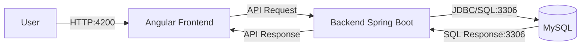

# Development Guide

## 📋 Table of contents

- [Introduction](#introduction)
- [Technologies](#technologies)
- [Tools](#tools)
- [Architecture](#architecture)
- [Quality Control](#quality-control)
- [Development Process](#development-process)

## 📖Introduction

The EasyMatch web application is developed as a **Single Page Application** (SPA) on the frontend. In a SPA, only a single HTML file is initially loaded, and the content is dynamically updated using TypeScript, rather than reloading complete pages from the server. This SPA, therefore frontend, was built using **Angular 20**.

On the backend, the application was developed using **Spring Boot**, offering a REST API to handle communication between the server and the client. For data management the application uses a **MySQL** database.

### 📌 Summary

| Component              | Description                                                                 |
|------------------------|-----------------------------------------------------------------------------|
| Application Type       | Web SPA with REST API                                                       |
| Frontend               | Angular                                                                     |
| Backend                | Spring Boot                                                                 |
| Database               | MySQL                                                                       |
| Languages              | Java, TypeScript and JavaScript                                             |
| IDE                    | Visual Studio Code                                                          |
| Auxiliary Tools        | Postman (Visual Studio Extension), Git and GitHub               |
| Tests                  | Unit, Integration and System (e2e) Tests                                    |
| Testing Libraries      | JUnit, AssertJ, Mockito, REST Assured, Selenium, Jasmine and Karma        |
| Deployment             | Docker                                                                      |
| Development Process    | Iterative and incremental, version control with Git and CI/CD with GitHub Actions |

## 💻Technologies

The website relies on the following technologies for its execution:

### Frontend
- **Node.js**: a JavaScript runtime environment that allows executing code outside the browser, typically used to support server-side development. For additional details, visit the [official Node.js web](https://nodejs.org/en).
- **npm**: default package manager for Node.js, used to install and manage project dependencies. More information is available on the [official npm website](https://www.npmjs.com/).
- **Angular**: a frontend framework designed for building dynamic Single Page Applications (SPAs). Learn more on the the  [Angular official web](https://angular.dev/).

---

### Backend
- **Maven**: build and dependency management tool for Java projects. For more information, consult the [Maven official web](https://maven.apache.org/).
- **Spring Boot**: a backend framework used to build Java-based web applications and RESTful APIs. For more details, visit the [official Spring website](https://spring.io/). Main modules:
  - **Spring MVC**: used to develop web applications and manage controllers.
  - **Spring Data**: facilitates interaction with the database.
  - **Spring Security**: handles authentication and authorization.
- **MySQL**: database used to store and manage the application data. For more information, consult the [MySQL official website](https://www.mysql.com/).


## 🔧Tools 

The following IDEs and auxiliary tools were used during the development of this website:

### IDEs
- **Visual Studio Code (VS Code)** is a lightweight, open-source code editor developed by Microsoft. It offers powerful features such as debugging, version control, and extension support. It was used to develop both the client (frontend) and server(backend) of the website.

### Auxiliary tools
- **Postman** is collaborative platform for testing and managing APIs. It allows sending HTTP requests, inspecting responses, and organizing collections to simplify API development and debugging.

- **Git** is a decentralized version control tool that helps manage and track changes in source code throughout the software development lifecycle.

- **GitHub** is a cloud-based service that hosts Git repositories and enhances them with collaborative features for developers. Within GitHub, you can find tools such as:
  - **GitHub Actions** that enables automation of continuous integration (CI) workflows.
  - **GitHub Projects** that assists in organizing tasks using a Kanban-style board layout.

- **Docker Desktop** which is a containerization platform that enables building, running, and managing applications within isolated containers. It will be used to package and deploy the web application consistently across different environments (CD).

## 🏛️Architecture 

### Deployment Architecture

The user engages with the frontend (Angular), which communicates with the backend (Spring) via the REST API. The backend, in turn, interacts with the MySQL database using JDBC to store and retrieve data.



As it is shown in the previous diagram, the deployment of the application is divided into 3 different proceses:

  1. **Frontend process** which runs in a development server on port 4200.
  2. **Backend process** which on port 8080 (http), but in a near future will switch to 8443 (https).
  3. **MySQL database** which runs on port 3306.


### REST API

This project includes a complete OpenAPI specification that describes all available endpoints, their parameters, and responses.
To make the documentation easier to explore, it has been converted to a static HTML file format using OpenAPI and it is used [RawGitHackservice](https://raw.githack.com) so it can be accessible without executing the application.

🔗 Access the API documentation here:
👉 [OpenAPI HTML Documentation](https://raw.githack.com/danielmunmar/2025-EasyMatch/docs/api-docs.html) <!-- Adaptar cuando se genere esta documentación -->


## 💎 Quality Control

### Backend Tests

#### Types of tests

- **Unit tests** aim to isolate and validate the **business logic** implemented within the **Service layer**. To achieve this, **mocks** are used to simulate the behavior of external dependencies such as **repositories**. In other words, unit tests focus exclusively on the logic within the **Services**, while their dependencies are replaced with mocked objects.

- **Integration tests** verify that the database interacts correctly with the rest of the backend components. Since the goal is to validate this real integration, **no mocks** are used, allowing the tests to run against the actual database layer.

- **System/e2e tests** are designed to validate the **complete functionality** of the system, ensuring that all components (from the frontend to the backend including database) work together as it is expected. They focus on verifying that API requests and user interactions produce the correct outcomes. For this purpose, **REST Assured** was used to test the REST API endpoints, while **Selenium** was employed to automate and validate user interface interactions in the browser.

#### Tests metrics

In order to generate a report using JaCoCo, you only need to execute the following command in a terminal inside the folder backend: 

```
mvn test
```

The following screenshot shows the coverage report of the executed tests:


JaCoCo generates automatically its coverage reports in the ```backend/target/site/jacoco``` folder. Nevertheless, in this project, the plugin configuration within the ```pom.xml``` file was modified so that the coverage report is generated **outside the target folder**. This adjustment ensures that the coverage report remains easily accessible at all times directly from the repository. 

```
<plugins>
  <plugin>
    <groupId>org.jacoco</groupId>
    <artifactId>jacoco-maven-plugin</artifactId>
    <executions>
      <execution>
        <goals>
          <goal>prepare-agent</goal>
        </goals>
      </execution>
      <execution>
        <id>report</id>
        <phase>test</phase>
        <goals>
          <goal>report</goal>
        </goals>
        <configuration>
          <outputDirectory>${project.basedir}/coverage</outputDirectory>
        </configuration>
      </execution>
    </executions>
  </plugin>
</plugins>
```
As it is shown in the previous code snippet, the coverage report is now generated by default in this project in ```/backend/coverage```. By opening the file ```index.html``` within that folder you can display the report in your browser.

### Frontend tests

#### Types of tests

- **Unit test**, in this context, are applied to **services** and **components** to ensure that each one functions correctly and independently. Once again **mocks** are used but in TypeScript.v

- **Integration tests** focus on verifying the interaction between services and components. Since the objective is to test their real integration, dependencies are not mocked, allowing the tests to run against the actual application context.

#### Metric tests

In order to generate a report using ```Karma```, you only need to execute the following command inside a terminal in the folder frontend: 

```
ng test --watch=false --code-coverage

```

The next picture illustrates the coverage report of the executed tests:


This process generates the report in the ```/frontend/coverage/frontend directory```. By opening the ```index.html``` file from that folder will display the coverage report in the browser.

## 🔁 Development process

### Continuous Integration (CI)

For Continuous Integration (CI), this project uses **GitHub Actions**. Two workflows were implemented to automate testing and ensure code quality:

#### Basic quality control

This workflow ```workflow1.yml``` is triggered on every commit made to non-main branches, specifically when changes occur in either the backend or frontend source code.

##### Jobs

- **build-backend**: set up the Java environment (JDK 21) and prepare the backend for testing.

- **backend-unit-tests**: execute the unit tests of the backend using Maven with ```mvn test -Dgroups='unit'```

- **build-frontend**: set up the Node.js environment (Node 20) and install dependencies.

- **frontend-unit-tests**: execute the unit tests of the frontend with ```npx ng test --include "src/**/*.unit.spec.ts" --watch=false --browsers=ChromeHeadless --no-progress```

#### Complete quality control

This workflow ```workflow2.yml``` is triggered when a Pull Request is opened targeting the main branch. It performs a complete validation pipeline of both the frontend and backend, including unit, integration, and system tests.

##### Jobs

- **build-backend**: set up the Java environment (JDK 21) and prepare the backend for testing.

- **build-frontend**: Set up and compile the frontend.

- **backend-unit-tests**: Run the backend unit tests with Maven using command ```mvn test -Dgroups='unit'```

- **backend-integration-tests**: Spin up a MySQL service and execute integration tests to validate database interaction ```mvn test -Dgroups='integration'```


- **build-frontend**: Set up and compile the frontend.

- **backend-system-tests**: Start the frontend and execute full end-to-end tests using the real backend ```mvn test -Dgroups='e2e'```

- **build-frontend**: Set up and compile the frontend.

- **frontend-unit-tests**: Run frontend unit tests with ```npx ng test --include "src/**/*.unit.spec.ts" --watch=false --browsers=ChromeHeadless --no-progress```

- **build-backend**: set up the Java environment (JDK 21) and prepare the backend for testing.

- **frontend-integration-tests**: Execute frontend integration tests using the same test runner ```npx ng test --include "src/**/*.integration.spec.ts" --watch=false --browsers=ChromeHeadless --no-progress```